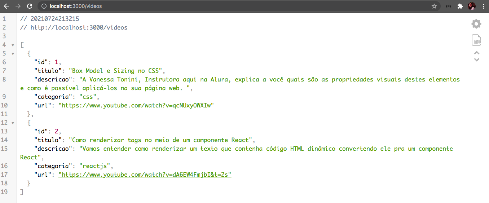

# API Rest com Node.js

## Tecnologias

- Node.js
- NPM
- Express
- MySQL (v 8.0)
- Postman

## Como usar

Use o NPM para rodar o projeto e colocá-lo no ar.

`npm start`

Instale as seguintes libs:
- Nodemon
- Consign

### Comandos 

`npm init`

`npm install express`

`"start": "node index.js"`

`npm install --save-dev nodemon`

`npm install consign`

`npm install mysql`

- SQL: `CREATE SCHEMA aluraflix;`

## Rotas

- GET all videos
- GET video by ID
- POST video
- PATCH video by ID
- DELETE video by ID

## Tabela atual no banco de dados

- id
- titulo
- descricao
- categoria
- url

## Validações

- Todos os campos são obrigatórios e precisam ser preenchidos

## API no ar

Acesse [/videos](http://localhost:3000/videos) no seu localhost.

